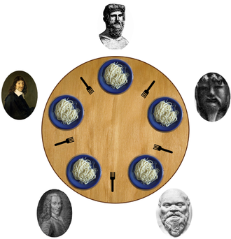

# Dining Philosophers Problem

## Technologie
* **C# 8.0**.

## Informacje

Pięciu filozofów siedzi przy stole i każdy wykonuje jedną z dwóch czynności – albo je, albo rozmyśla. Stół jest okrągły, przed każdym z nich znajduje się miska ze spaghetti, a pomiędzy każdą sąsiadującą parą filozofów leży widelec, a więc każda osoba ma przy sobie dwie sztuki – po swojej lewej i prawej stronie. Ponieważ jedzenie potrawy jest trudne przy użyciu jednego widelca, zakłada się, że każdy filozof korzysta z dwóch. Dodatkowo nie ma możliwości skorzystania z widelca, który nie znajduje się bezpośrednio przed daną osobą.

 
